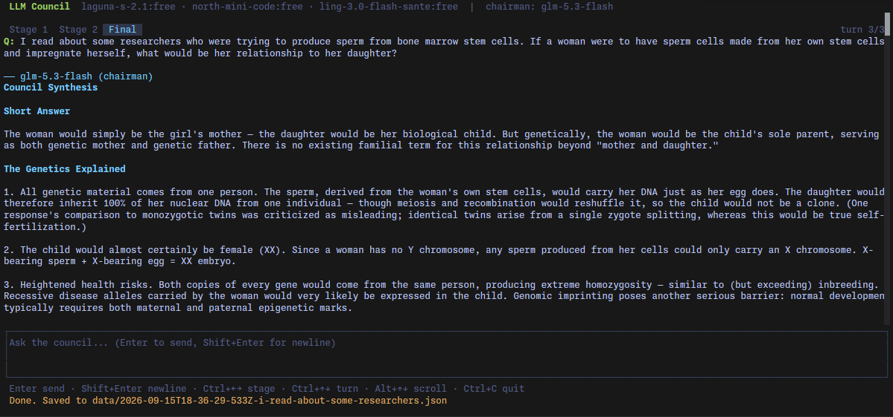

# LLM Council TUI




Terminal rebuild of [LLM Council](https://github.com/karpathy/llm-council): 3-stage deliberation where multiple
LLMs answer, rank each other anonymously, and a chairman synthesizes the final answer.

## Run

```bash
bun install
cp config.json.example config.json
echo 'OPENROUTER_API_KEY=sk-...' > .env   # bun auto-loads .env
bun start                                 # will remind you to configure models
```

## Keys

| Key          | Action                  |
| ------------ | ----------------------- |
| `Enter`      | Send question           |
| `Shift+Enter` | Newline in input       |
| `Ctrl+←/→`   | Switch stage tab        |
| `Ctrl+↑/↓`   | Switch turn             |
| `Alt+↑/↓`    | Scroll content          |
| `Ctrl+C`     | Quit                    |

## Configure

All settings live in `config.json`, next to the source (restart after editing):

```json
{
  "councilModels": [
    "openai/gpt-5.1",
    "google/gemini-3-pro-preview",
    "anthropic/claude-sonnet-4.5",
    "x-ai/grok-4"
  ],
  "chairmanModel": "google/gemini-3-pro-preview",
  "baseURL": "https://openrouter.ai/api/v1"
}
```

- Model IDs are [OpenRouter](https://openrouter.ai/models) slugs - any chat model there works.
- The chairman can be one of the council or a different model.
- `baseURL` can point at a proxy or local gateway instead of OpenRouter.
- The API key stays in `.env` as `OPENROUTER_API_KEY` - never put it in `config.json`.

## Persistence

Every council run is saved to `data/<id>.json` - question, all three stages, parsed rankings and the
aggregate. Written after each stage completes, so a crash mid-run still keeps partial results.
At startup the archive is read back in: browse saved runs with `Ctrl+↑/↓`, exactly like fresh ones.
Archived runs are view-only; asking a new question appends a new run.

## Tests

```bash
bun test
```
